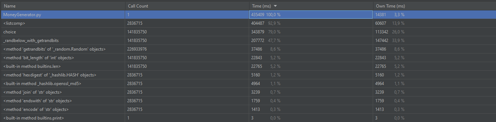
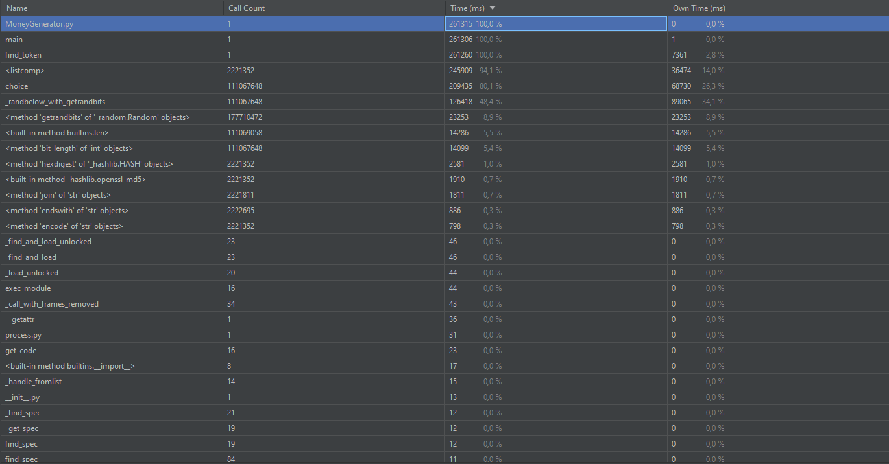

# Результат работы `CPU-bound`

**Время синхронной генерации токена:**

**Время асинхронной генерации токена (2 воркера):**

**Загрузка системы при асинхронной генерации токена (2 воркера):**

**Время асинхронной генерации токена (4 воркера):**

**Загрузка системы при асинхронной генерации токена (4 воркера):**

**Время асинхронной генерации токена (5 воркеров):**

**Загрузка системы при асинхронной генерации токена (5 воркеров):**

**Время асинхронной генерации токена (10 воркеров):**

**Загрузка системы при асинхронной генерации токена (10 воркеров):**

**Время асинхронной генерации токена (61 воркер):**

**Загрузка системы при асинхронной генерации токена (61 воркер):**

# Вывод

**Так как задача CPU bound, наращивать количество воркеров, большее количества ядер, бесполезно.**