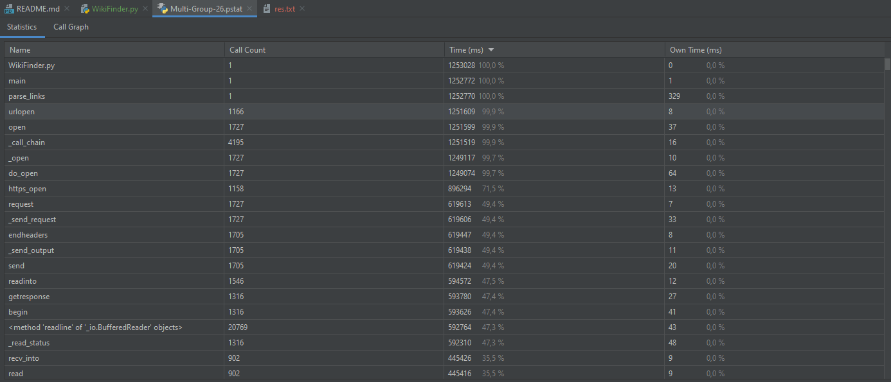
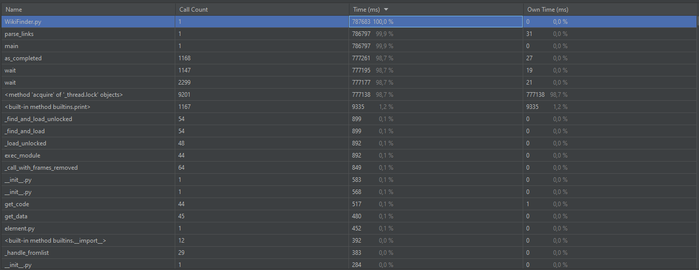
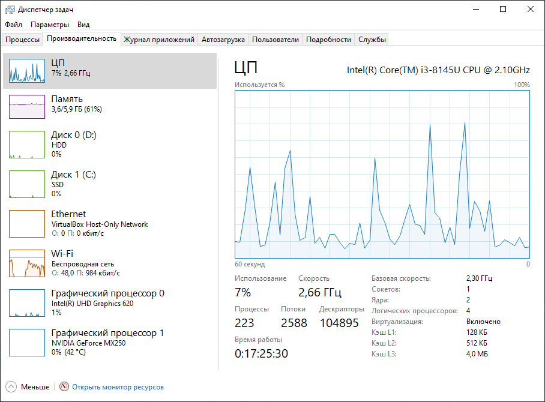
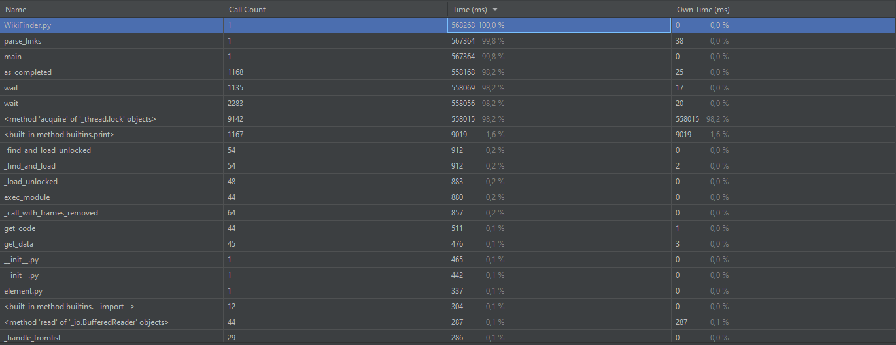
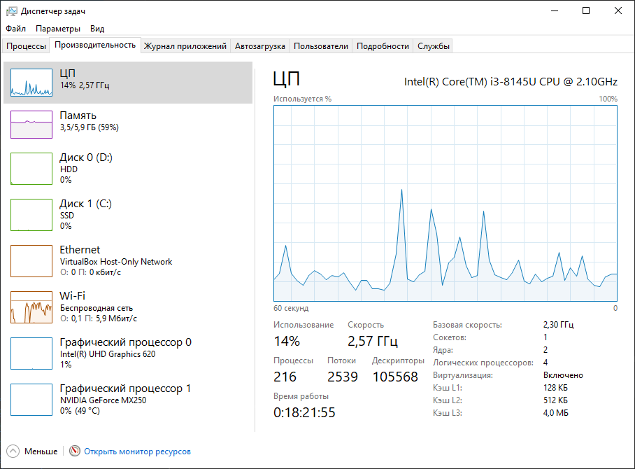
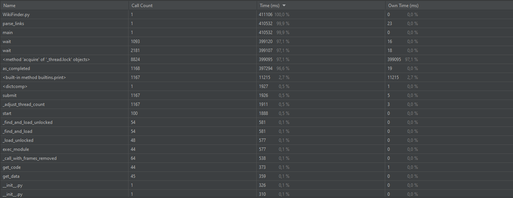
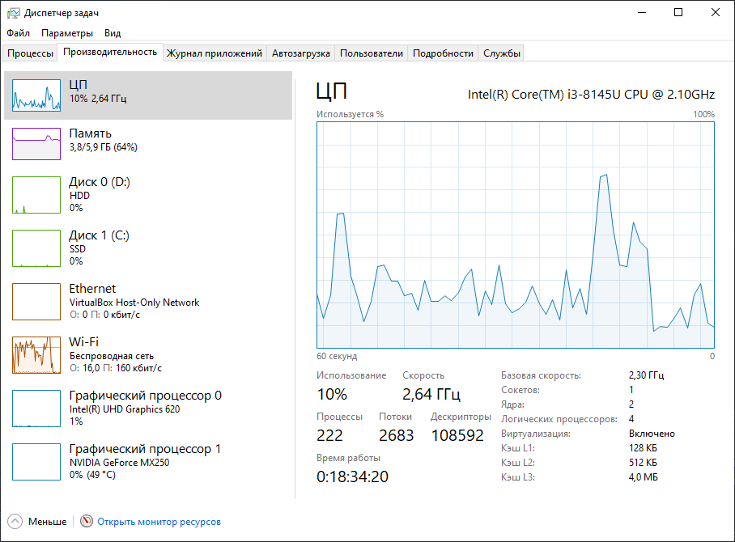

# Результат работы `IO-bound`

**Время синхронной проверки ссылок:**

**Время асинхронной проверки ссылок (5 воркеров):**

**Загрузка системы при асинхронной проверке ссылок (5 воркеров):**

**Время асинхронной проверки ссылок (10 воркеров):**

**Загрузка системы при асинхронной проверке ссылок (10 воркеров):**

**Время асинхронной проверки ссылок (100 воркеров):**

**Загрузка системы при асинхронной проверке ссылок (100 воркеров):**

# Вывод

**Время работы с увеличением количества воркеров значительно уменьшается. Загрузка памяти практически не изменяется, а загрузка процессора и сети увеличивается.**
