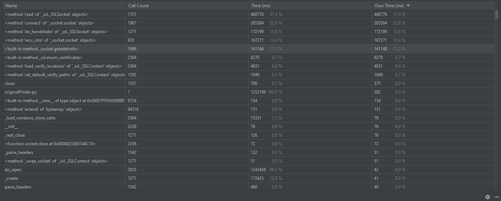
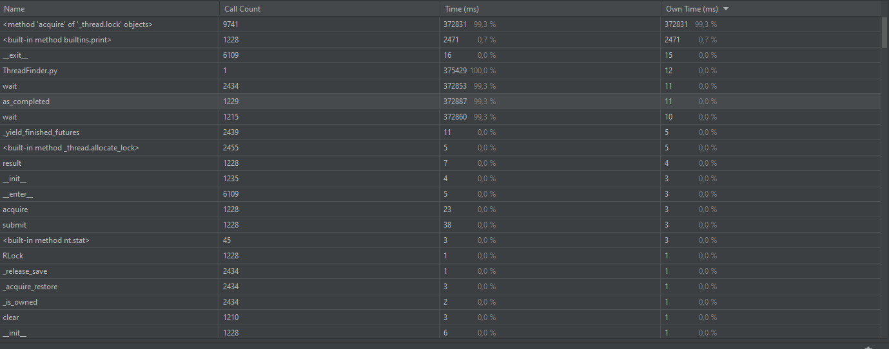
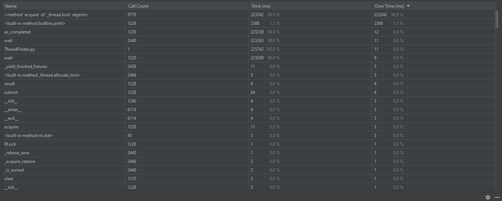
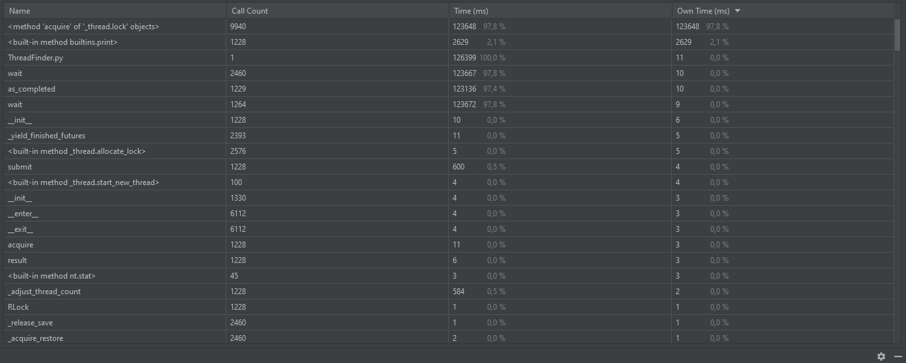

Время выполнения кода без потоков: 
Время выполнения с 5 потоками: 
Время выполнения с 10 потоками: 
Время выполнения со 100 потоками: 
памяти, процессора, сети, время работы
Чем больше воркеров я использую, тем больше потребляется сети и процессора, становится меньше время работы, загрузка памяти не меняется.

CPU-Bound
Время выполнения кода без потоков: нашёл 2 монеты за 121 секунду
Время выполнения с 2 потоками: нашёл 2 монет за 143 секунду
Время выполнения с 4 потоками: нашёл 2 монеты за 29 секунду
Время выполнения со 5 потоками: нашёл 2 монеты за 46 секунду
Время выполнения со 10 потоками: нашёл 2 монеты за 61 секунду
Время выполнения со 100 потоками: 0 монет за 0 секунд (ValueError: max_workers must be <= 61)
По мере увеличения воркеров растёт нагрузка на процессор, но время уменьшается только до тех пор, пока кол-во воркеров не превосходит кол-во ядер.
В использовании памяти и сети я не увидел особой разницы.